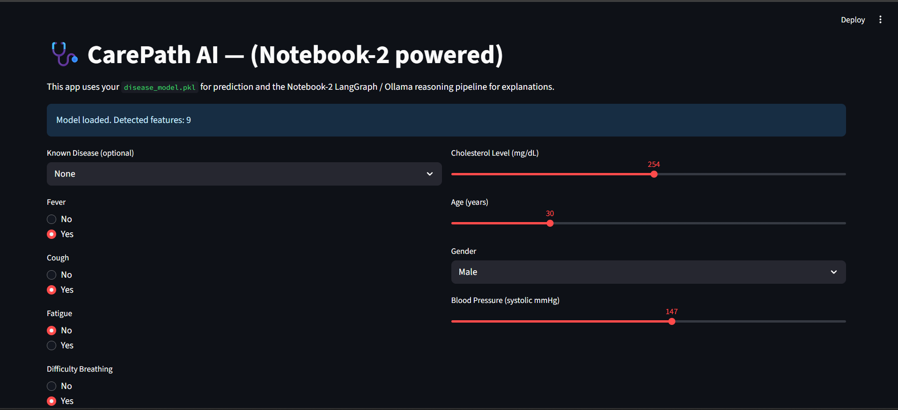
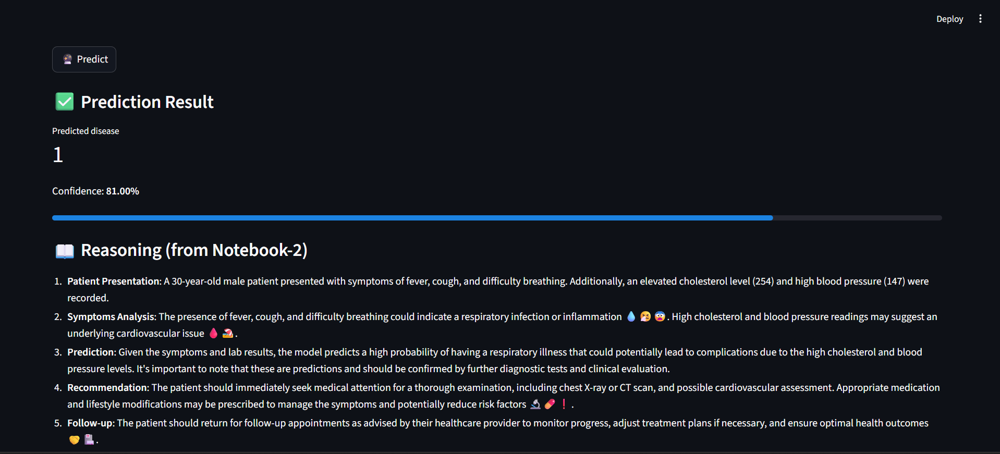
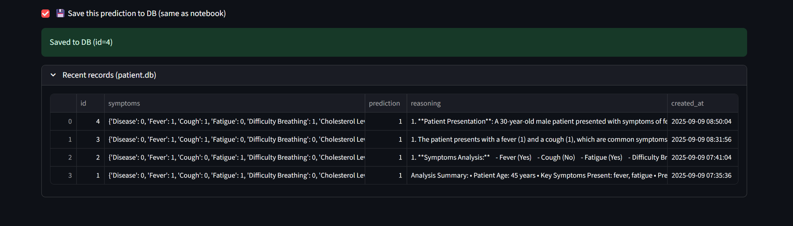

🩺 CarePath AI
Your personal AI-powered medical assistant that predicts patient outcomes and provides interpretable reasoning for clinical data!

📌 What is this?
CarePath AI is a full-stack AI tool that:

🔎 Uses classical ML models (Random Forest, etc.) to predict patient outcomes  
📄 Analyzes patient data (age, symptoms, vitals) for structured predictions  
📦 Integrates LangChain + FAISS for retrieval-augmented reasoning (RAG)  
🤖 Uses LLMs (Ollama, OpenAI, or Gemini) to generate human-readable reasoning for predictions  
💬 Provides confidence scores and detailed explanations for each prediction  
🌐 Comes with a Streamlit frontend for easy input and visualization  

🚀 Features
🔍 Symptom-based Outcome Prediction: Enter patient data to get predictive results  
📥 ML + LLM Hybrid Reasoning: Combines Random Forest predictions with LLM explanations via LangChain RAG  
🧠 Multi-layer Insight: Get interpretable reasoning for why a prediction was made  
✍️ Flexible LLM Options: Works with Ollama (llama3, mistral) or cloud APIs (OpenAI/Gemini)  
🌈 Interactive UI: Modern Streamlit layout for inputting patient data and receiving predictions & reasoning  

⚙️ Tech Stack
Layer           | Tools/Frameworks
----------------|----------------
🔗 Backend       | Python, Pandas, scikit-learn, LangChain, FAISS
🧠 ML Models     | Random Forest, other supervised ML models
🧠 LLM          | Ollama (llama3, mistral) / OpenAI / Gemini
🗄️ Database     | SQLite (patient.db)
🖥️ Frontend     | Streamlit
🐳 Deployment   | Docker container  

### 📸 Screenshots of CarePath-AI

1. **Main Dashboard**  


2. **Prediction, Confidence Output & Reasoning**  


3. **Database Entries**  



💡 How It Works (Workflow)
```text
User Input (Age, Symptoms, Vitals)
        │
        ▼
    Random Forest
        │
        ▼
  Predicted Outcome + Confidence
        │
        ▼
   LangChain RAG Query
        │
        ▼
        LLM
  (Reasoning / Explanation)
        │
        ▼
 Streamlit UI → Display Prediction + Reasoning
User enters patient information (age, symptoms, vitals)

ML model predicts outcome with confidence score

LangChain RAG queries patient data and sends context to LLM

LLM generates reasoning for the prediction

Streamlit UI displays prediction + reasoning

Optional: Use cloud APIs instead of local Ollama server

🧪 Supported Ollama Models
👉 Make sure to pull them first if using Ollama locally:
ollama pull llama3
ollama pull mistral
🙌 Acknowledgements

LangChain

Ollama

Streamlit

scikit-learn

🧔‍♂️ Author
Made By 💻 by Karan Shelar

🌟 Show Your Support
⭐ Star it on GitHub
🍴 Fork it
🚀 Share it with others!
